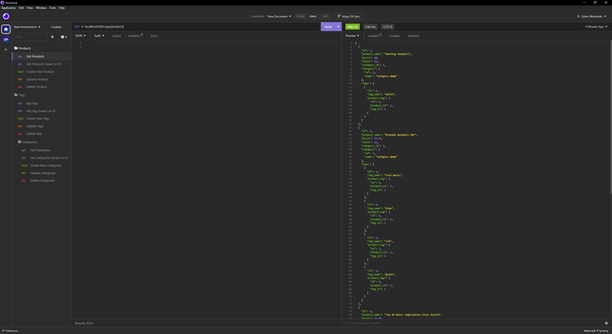

  # E-commerce Back End
  
  ## Description 
  This application was created with [Express.js](https://expressjs.com/), [Node.js](https://nodejs.org/en), and [Sequelize](https://sequelize.org/). This application creates a back end for an e-commerce website.
  
  ## Table of Contents
  * [Technology Stack](#technology-stack)
  * [User Story](#user-story)
  * [Acceptance Criteria](#acceptance-criteria)
  * [Installation](#installation)
  * [API Routes](#api-routes)
  * [Screenshot](#screenshot)
  * [Usage](#usage)
  * [License](#license)

    ## Technology Stack


  ## User Story
  ```md
  AS A manager at an internet retail company
  I WANT a back end for my e-commerce website that uses the latest technologies
  SO THAT my company can compete with other e-commerce companies
  ```

  ## Acceptance Criteria
  ```md
GIVEN a functional Express.js API
WHEN I add my database name, MySQL username, and MySQL password  
to an environment variable file
THEN I am able to connect to a database using Sequelize
WHEN I enter schema and seed commands
THEN a development database is created and is seeded with test data
WHEN I enter the command to invoke the application
THEN my server is started and the Sequelize models are synced  
to the MySQL database
WHEN I open API GET routes in Insomnia Core for categories, products,  
or tags
THEN the data for each of these routes is displayed in a formatted  
JSON
WHEN I test API POST, PUT, and DELETE routes in Insomnia Core
THEN I am able to successfully create, update, and delete data in  
my database
  ```
  
  ## Installation 
  
* Clone the repository.
  ```
    git@github.com:iam3dski/e-commerce-back-end.git
  ```
   * Install the dependencies.
    * Install [MySQL](https://dev.mysql.com/doc/mysql-installation-excerpt/5.7/en/)
  ```
  npm i
  ```
  
  * CD into the db directory
  ```
    cd db
  ```

  Start the MySQL server in the terminal (ensure you are in the db directory of the project)

  ``` bash
    mysql -u root -p 
  ```

  Enter the password
  ``` bash
    password_goes_here
  ```

  Once MySQL server has started, create the database

  ``` bash
    SOURCE createDatabase.sql
  ```

  Exit the MySQL server
  ``` bash
    exit OR quit
  ```

  * Return to the root directory
  ```
    cd ..
  ```

  Update .env.example in the root directory and set your local MySQL server username and password. Then rename to .env
  > Don't worry, your credentials will only be saved to your local machine. The .env file is in .gitignore
  ``` bash
    DB_NAME = ""
    DB_USER = ""
    DB_PW = ""
  ```

  Seed the database
   ``` bash
    npm run seed
  ```

  Start the application
   ``` bash
    npm start
  ```
  > Once the server is listening use the below commands in Insomnia to view the data  
   ## API Routes
  
  ### Category Routes
  * Get all categories and their associated products: 
    - **GET** localhost:3001/api/categories
  * Get one category based on id with their associated products: 
    - **GET** localhost:3001/api/categories/:id
  * Create a new category: 
    - **POST** localhost:3001/api/categories
    - Set Body to JSON, then use the following data structure:
      ``` json
        { 
          "category_name": "name here" 
        }
      ```
  * Update a category: 
    - **PUT** localhost:3001/api/categories/:id
    - Set Body to JSON, then use the following data structure:
      ``` json
        { 
          "category_name": "name here" 
        }
      ```
  * Delete a category: 
    - **DELETE** localhost:3001/api/categories/:id

  ### Tag Routes
  * Get all tags and their associated products: 
    - **GET** localhost:3001/api/tags
  * Get one tag based on id with their associated products: 
    - **GET** localhost:3001/api/tags/:id
  * Create a new tag: 
    - **POST** localhost:3001/api/tags
    - Set Body to JSON, then use the following data structure:
      ``` json
        { 
          "tag_name": "name here" 
        }
      ```
  * Update a tag: 
    - **PUT** localhost:3001/api/tags/:id
    - Set Body to JSON, then use the following data structure:
      ``` json
        { 
          "tag_name": "name here" 
        }
      ```
  * Delete a tag: 
    - **DELETE** localhost:3001/api/tags/:id

  ### Product Routes
  * Get all products and their associated categories and tags: 
    - **GET** localhost:3001/api/products
  * Get one product based on id with their associated categories and tags: 
    - **GET** localhost:3001/api/products/:id
  * Create a new product: 
    - **POST** localhost:3001/api/product
    - Set Body to JSON, then use the following data structure:
      ``` json
        { 
          "product_name": "name here", 
          "price": 50.00, 
          "stock": 3, 
          "tagIds": [1, 2, 3, 4], 
          "category_id": 1 
        }
      ```
  * Update a product: 
    - **PUT** localhost:3001/api/products/:id
    - Set Body to JSON, then use the following data structure:
      ``` json
        {
          "product_name": "RKS",
          "price": 21.50,
          "stock": 9,
          "category_id": 4,
          "tags": [
            {
              "tag_id": 1
            },
            {
              "tag_id": 7
            }
          ]
        }
      ```
  * Delete a product: 
    - **DELETE** localhost:3001/api/products/:id

  ## Screenshot
  
  
  
  ## Usage


 ## License 
 
  [](https://lbesson.mit-license.org/)